# Laboratory 1 — Custom Trainer, MyResNet API, and Experiments on CIFAR-10/100

## Overview

In this first laboratory, I focused on the construction of a comprehensive `Trainer` class and its methods to facilitate downstream tasks throughout all other laboratories.  
The class implements a variety of functionalities (see the README in the [main folder](../README.md)).

Alongside the `Trainer` class, I implemented a class **`MyResNet`**, designed as an easy-to-use API for building neural networks composed of:

- Convolutional layers  
- Batch normalization layers  
- Dropout layers  
- Linear layers  
- Activation functions  

---

## MyResNet — Design and Features

The API takes arguments in the form of tuples:

```
(layer_type, param1, param2, ...)
```
Example:  
```python
("Linear", in_size, hidden_size, out_size)
```

It also supports **skip connections** in dictionary format:
```python
{index_from: index_to}
```

### Public Methods
- `addConv`
- `addLinear`
- `get_submodel`
- `test` — includes optional confusion matrix plotting (`plot=True`).

### Shape Mismatch Handling
If there is a mismatch between:
- Sequential layers, or
- Layers connected via skip connections,  

the class automatically **reprojects** using flattening followed by a linear layer.

**Note:** To create skip connections and handle reprojections, the **data shape must be provided at initialization**.

---

## Task 1 — MLP Experiment

**Architecture:**  
- Depth: 3  
- Hidden size: 64  

**Training parameters:**  
- Epochs: up to 25  
- Early stopping: patience = 2 (check validation every epoch)  
- Batch size: 256  
- Learning rate: 0.001  
- Optimizer: Adam  
- Weight decay: 1e-4
- split 0.2-0.8 (validation/train) of training set

**Results:**  

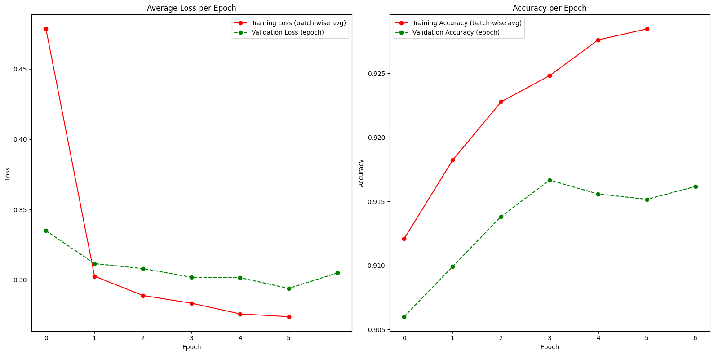
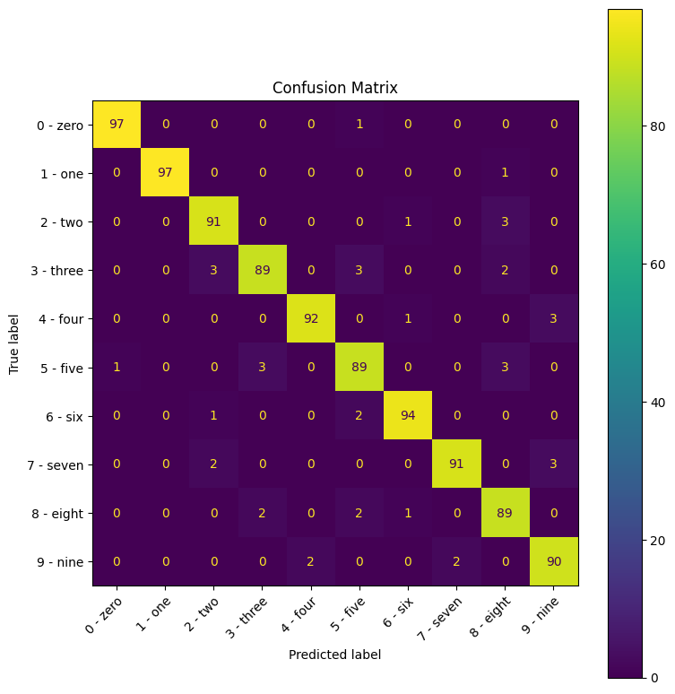

*Test set loss: 0.2778, accuracy: 0.9235*

---

## Task 2 — MLP Depth and Skip Connections

Repeated the experiment for depths **3, 5, 7, 9**:

- With skip connections  
- Without skip connections  

**Training parameters:**  
- Epochs: up to 20  
- Early stopping: patience = 3 (check validation every epoch)  
- Batch size: 256  
- Learning rate: 0.0001  
- Optimizer: Adam  
- Weight decay: 1e-4
- split 0.2-0.8 (validation/train) of training set 

**Observation:**  
Networks with skip connections **consistently outperformed** their counterparts.

**Results:**  
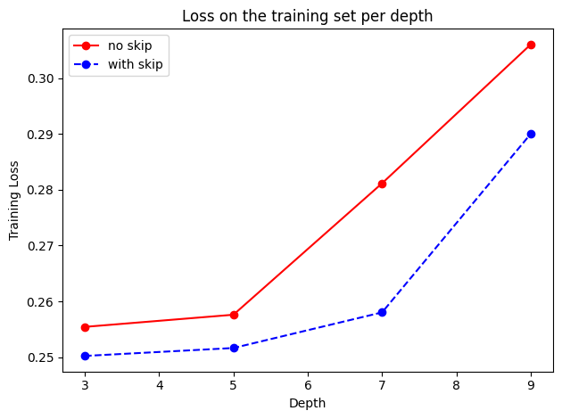
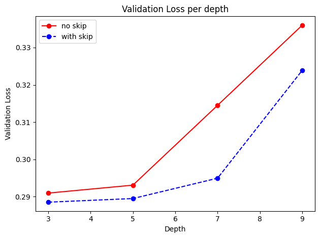

---

## Task 3 — ResNet Architectures, CIFAR10

**Architectures tested:**
1. Small ResNet without skip connections (**benchmark**) *13 layers*
2. Medium ResNet with skip connections *27 layers*
3. Medium ResNet without skip connections *27 layers*, *4 skip connections*
4. Deeper ResNet without skip connections *30 layers*
5. Deeper ResNet with skip connections *30 layers*, *5 skip connections*

**Training parameters:**
- Optimizer: Adam (`lr = 0.0001`)
- Batch size: 64
- Epochs: up to 65
- Early stopping: 3 validations without improvement (validation checked every 3 epochs)
- Train/validation split: 80%/20%
- Data augmentation: applied to 40% of the training set

**Data Augmentation:**
-RandomCrop(32, padding=4)
-RandomHorizontalFlip()
-ToTensor()
-Normalize((0.4914, 0.4822, 0.4465), (0.2023, 0.1994, 0.2010))

**Results:**
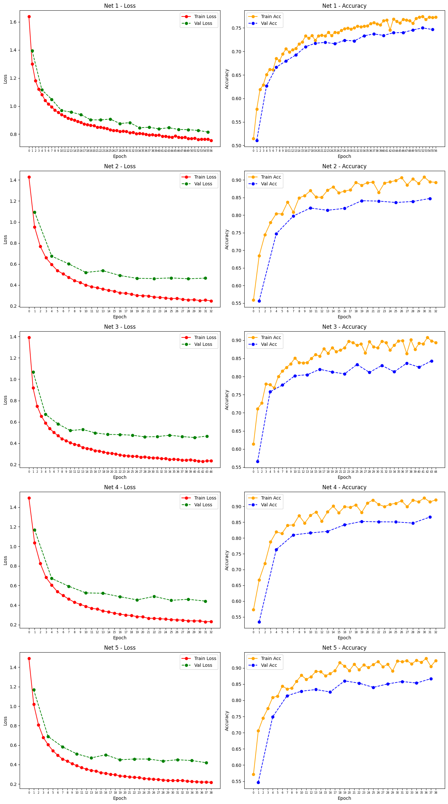
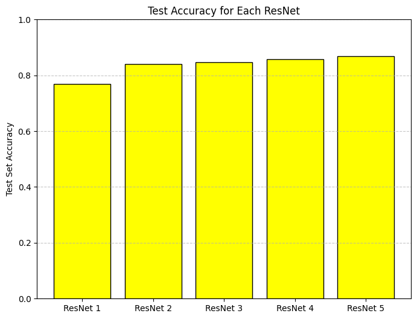
- Networks with skip connections prevailed in:
  - Performance
  - Less tendency to overfit early  
- Best model: Deeper ResNet with skip connections → *Test set loss: 0.4854, accuracy: 0.8681*
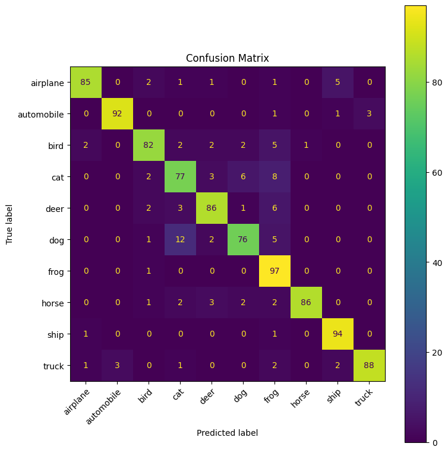

---

## Task 4 — Fine-Tuning on CIFAR-100

1. **Baseline:**  
   - Features extracted from the **last first linear layer** of the best CNN (the last convonutional layer had too big tensors and algorithms used in baseline struggled to converge)
   - KNN with **100 neighbours and euclidean distance**  
   - Observed accuracy: *0.0101*  

2. **Fine-tuning Protocol:**
   Since the baseline suggested that the features were far from being useful on CIFAR-100, I tried to reshape the weights without catastrophic forgetting. I first trained for a few epochs with all layers
   unfrozen and a small learning rate, then focused only on specific layers, changing optimizers along the way to slow down weight modifications — a sort of reverse progressive unfreezing.
   I removed the previous classifier and added another head to the net with this layers:
   *Linear (in_size=4096, width=1024, depth=2, out_size=512, activation=ReLU), Dropout (p=0.8, activation=ReLU), Linear (in_size=512, width=128, depth=2, out_size=100, activation=None)*

   **All layers unfrozen**
   -Epochs: up to 20
   -Early stopping: patience = 1 (check validation every 3 epochs)
   -Batch size: 256
   -Learning rate: 0.00005
   -Optimizer: Adam (weight decay = default)
   -Split: 0.2–0.8 (validation/train) of training set
   -Layers unfrozen: 0–31
   -Data augmentation: applied to 40% of the training data, pipeline = augment

   **Deeper convolutional layers and classifier unfrozen**
   -Epochs: up to 20
   -Early stopping: patience = 3 (check validation every 2 epochs)
   -Batch size: 256
   -Learning rate: 0.0001
   -Optimizer: SGD (momentum = 0.9, weight decay = 1e-4)
   -Split: 0.2–0.8 (validation/train) of training set
   -Layers unfrozen: 11–31
   -Data augmentation: applied to 40% of the training data, pipeline = augment

   **Classifier layers unfrozen**
   -Epochs: up to 20
   -Early stopping: patience = 2 (check validation every 3 epochs)
   -Batch size: 256
   -Learning rate: 0.001
   -Optimizer: SGD (momentum = 0.6, weight decay = 1e-4)
   -Split: 0.2–0.8 (validation/train) of training set
   -Layers unfrozen: 22–31
   -Data augmentation: applied to 40% of the training data, pipeline = augment

   **Augment pipeline:**
   -RandomAffine(degrees=15, translate=(0.1, 0.1), scale=(0.9, 1.1), shear=10)
   -RandomHorizontalFlip()
   -ColorJitter(brightness=0.3, contrast=0.3, saturation=0.2, hue=0.05)
   -ToTensor()
   -GaussianBlur(3, sigma=(0.1, 2.0))
   -RandomErasing(p=0.5, scale=(0.02, 0.2), ratio=(0.3, 3.3))
   -Normalize((0.5071, 0.4865, 0.4409), (0.2673, 0.2564, 0.2762))

**Results:**  
Results showed that, contrary to the baseline, there was useful information in the features extracted from the network, achieving decent performance on CIFAR-100 with only a few epochs of fine-tuning.
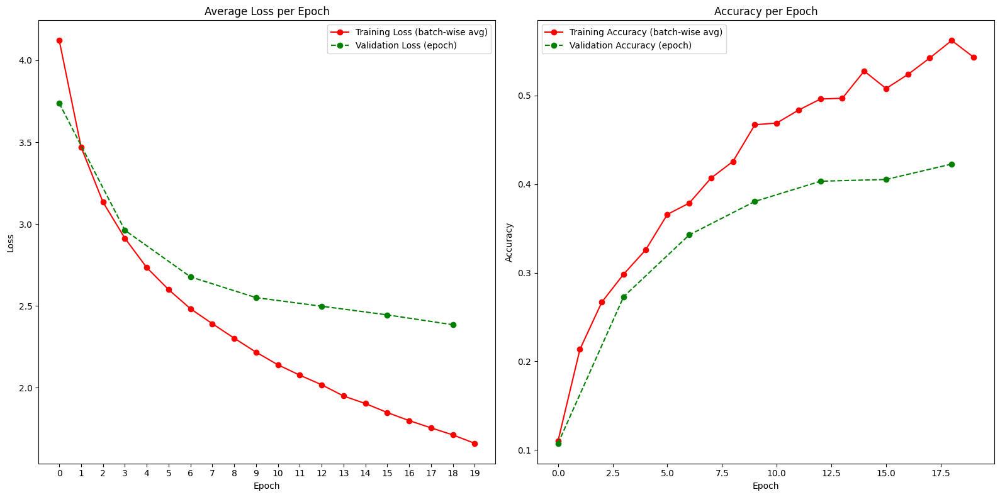
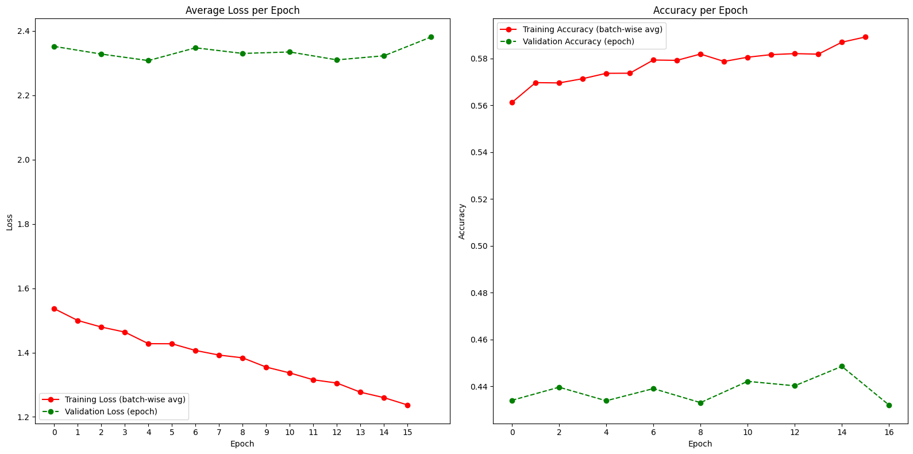
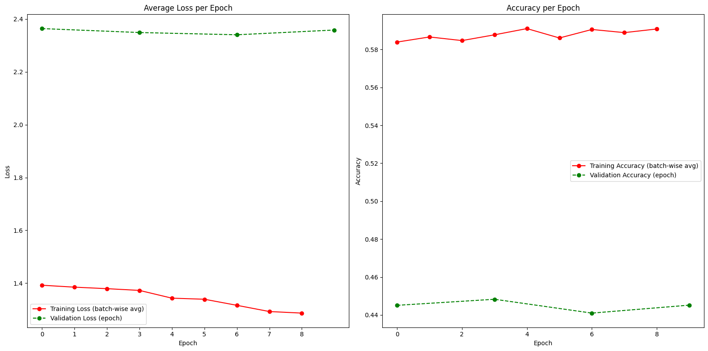
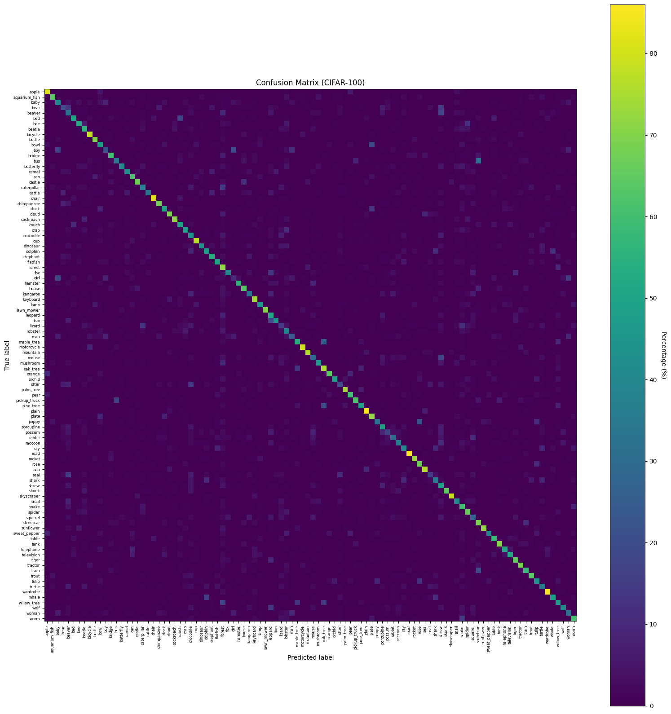

*Test set loss: 1.9734, accuracy: 0.5392*

---


