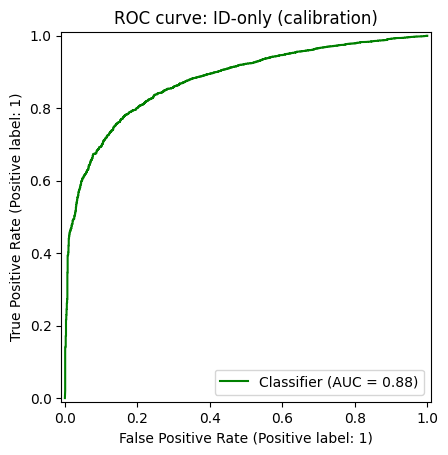

## OOD Detection and calibration with Temperature Scaling

For calibration with temperature scaling:

- **Score function:** `max_softmax`
- **Temperature range:** 0.5 to 10.0 (step 0.5)
- **Selection criterion:** lowest **ECE** (Expected Calibration Error), automatically selected.
- **In-distribution dataset:** CIFAR-10
- **Out-of-distribution dataset:** CIFAR-100
The model used is the [best ResNet from lab1](../bestCNNv2.pth)

**Results:**

 

 

---

## FGSM Adversarial Attacks

For the FGSM task, a function was implemented to perform **untargeted** or **targeted** attacks, depending on the provided arguments (see [OOD_script](../deeo_learning_utils/src/OOD/OOD_utils.py)):

- Both **single sample** and **batch** versions are available.
- The **batch version** is used internally in the [Trainer_script](../deeo_learning_utils/src/Trainer/Trainer.py) class for adversarial training (private method).
- The **public method** is for single sample attacks.

**Examples:**

- Visualizations include:
  - Attacked image
  - Perturbation heatmap
  - Predicted label
  - Attack budget

**Attack budgets:**
- Untargeted: `0.01` to `0.09`
- Targeted: `0.01` to `0.19`

*Untargeted attacks*

*Targeted attacks (target class: **bird**)*

---

## Image Quality Degradation

To quantitatively assess image degradation for both attack types, the metric *PSNR* (Peak Signal-to-Noise Ratio, batch average) was used:

*Untargeted attacks*

---

## Adversarial Training

Training with **untargeted adversarial attacks** on the same model from 0 on CIFAR10 was performed on the fly:

- Epochs: up to 65
- Early stopping: patience = 3 (check validation every 3 epochs)
- Batch size: 64
- Learning rate: 0.001
- Optimizer: Adam (weight decay = 1e-4)
- Split: 0.2–0.8 (validation/train) of training set
- Data augmentation: applied to 40% of the training data, pipeline =
  -andomCrop(32, padding=4)
  -RandomHorizontalFlip()
  -ToTensor()
  -Normalize((0.4914, 0.4822, 0.4465), (0.2023, 0.1994, 0.2010))
- FGSM attack budget: 0.01

Then, calibration with T scaling and OOD detection was performed on the newly trained model:

 

 

---

## Conclusions
The adversarial training produced a model more robust in discriminating between ID and OOD objects, as shown by the more separated distribution of the scores compared to the same model without adversarial training and by the increase in AUPR (from *64* to *83*). There is a slight decrease in AUROC (from *88* to *86*), suggesting that the model is better at distinguishing ID from OOD but with generally lower confidence towards ID objects. Consistently, the improved OOD performance came at the cost of a decrease in accuracy on the ID test set, from *0.8681* to *0.8106*.

